.. _top_level_interface_signals:

Top-Level Interface Signals
---------------------------
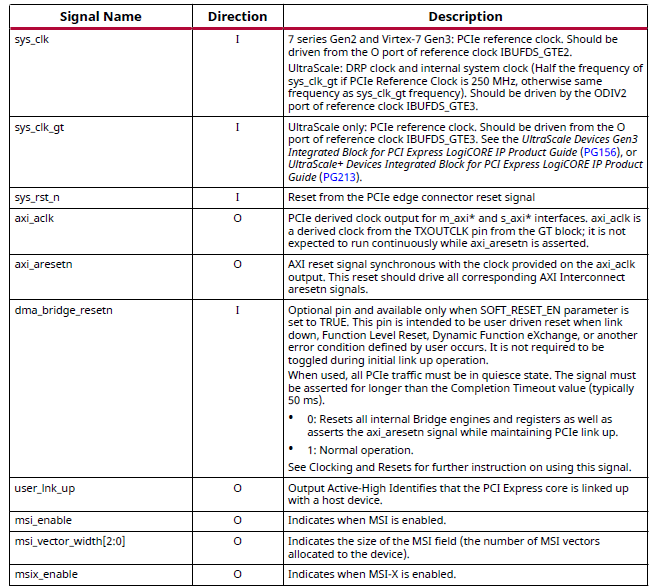

.. note::

   See the latest version of PG195 for updates

.. _h2c_channel_0_3_axi4_stream_interface_signals:

H2C Channel 0-3 AXI4-Stream Interface Signals
---------------------------------------------

   .. note::

   See the latest version of PG195 for updates

.. _c2h_channel_0_3_axi4_stream_interface_signals:

C2H Channel 0-3 AXI4-Stream Interface Signals
---------------------------------------------

.. note::

   See the latest version of PG195 for updates

.. _axi4_memory_mapped_read_address_interface_signals:

AXI4 Memory Mapped Read Address Interface Signals
-------------------------------------------------

.. note::

   See the latest version of PG195 for updates

.. _axi4_memory_mapped_read_interface_signals:

AXI4 Memory Mapped Read Interface Signals
-----------------------------------------
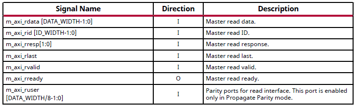

.. note::

   See the latest version of PG195 for updates

.. _axi4_memory_mapped_write_address_interface_signals:

AXI4 Memory Mapped Write Address Interface Signals
--------------------------------------------------
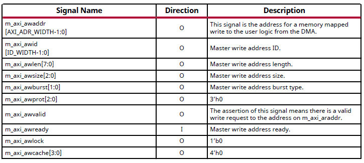

.. note::

   See the latest version of PG195 for updates

.. _axi4_memory_mapped_write_interface_signals:

AXI4 Memory Mapped Write Interface Signals
------------------------------------------

.. note::

   See the latest version of PG195 for updates

.. _axi4_memory_mapped_write_response_interface_signals:

AXI4 Memory Mapped Write Response Interface Signals
---------------------------------------------------

.. note::

   See the latest version of PG195 for updates

.. _axi4_memory_mapped_master_bypass_read_address_interface_signals:

AXI4 Memory Mapped Master Bypass Read Address Interface Signals
---------------------------------------------------------------

.. note::

   See the latest version of PG195 for updates

.. _axi4_memory_mapped_master_bypass_read_interface_signals:

AXI4 Memory Mapped Master Bypass Read Interface Signals
-------------------------------------------------------
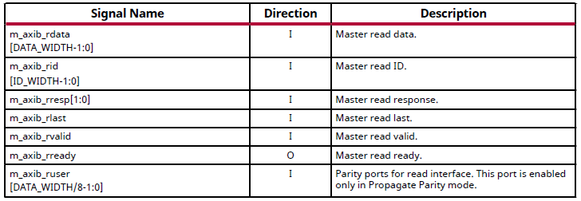

.. note::

   See the latest version of PG195 for updates

.. _axi4_memory_mapped_master_bypass_write_address_interface_signals:

AXI4 Memory Mapped Master Bypass Write Address Interface Signals
----------------------------------------------------------------

.. note::

   See the latest version of PG195 for updates

.. _axi4_memory_mapped_master_bypass_write_interface_signals:

AXI4 Memory Mapped Master Bypass Write Interface Signals
--------------------------------------------------------

.. note::

   See the latest version of PG195 for updates

.. _axi4_memory_mapped_master_bypass_write_response_interface_signals:

AXI4 Memory Mapped Master Bypass Write Response Interface Signals
-----------------------------------------------------------------

.. note::

   See the latest version of PG195 for updates

.. _config_axi4_lite_memory_mapped_write_master_interface_signals:

Config AXI4-Lite Memory Mapped Write Master Interface Signals
-------------------------------------------------------------

.. note::

   See the latest version of PG195 for updates

.. _config_axi4_lite_memory_mapped_read_master_interface_signals:

Config AXI4-Lite Memory Mapped Read Master Interface Signals
------------------------------------------------------------

.. note::

   See the latest version of PG195 for updates

.. _config_axi4_lite_memory_mapped_write_slave_interface_signals:

Config AXI4-Lite Memory Mapped Write Slave Interface Signals
------------------------------------------------------------

.. note::

   See the latest version of PG195 for updates

.. _config_axi4_lite_memory_mapped_read_slave_interface_signals:

Config AXI4-Lite Memory Mapped Read Slave Interface Signals
-----------------------------------------------------------
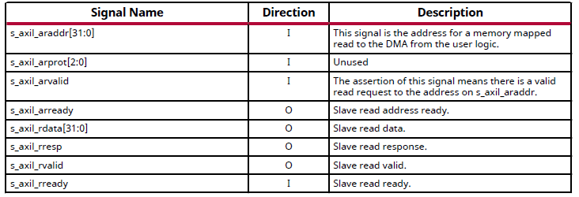

.. note::

   See the latest version of PG195 for updates

.. _interrupt_interface:

Interrupt Interface
-------------------

.. note::

   See the latest version of PG195 for updates

.. _channel_0_3_status_ports:

Channel 0-3 Status Ports
------------------------
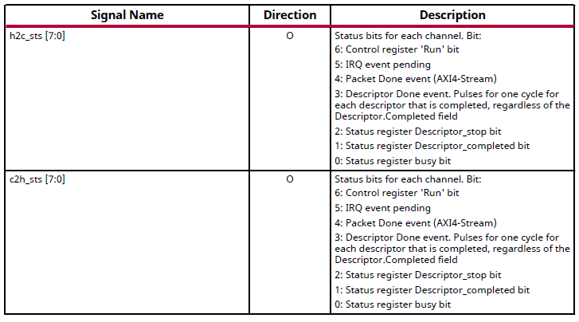

.. note::

   See the latest version of PG195 for updates

.. _configuration_extend_interface_port_descriptions:

Configuration Extend Interface Port Descriptions
------------------------------------------------

.. note::

   See the latest version of PG195 for updates

.. _configuration_management_interface_ports:

Configuration Management Interface Ports
----------------------------------------
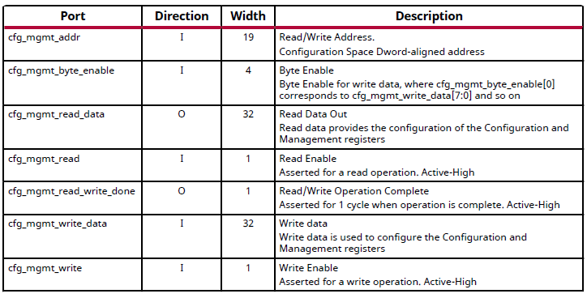

.. note::

   See the latest version of PG195 for updates

.. _h2c_0_3_descriptor_bypass_port:

H2C 0-3 Descriptor Bypass Port
------------------------------

.. note::

   See the latest version of PG195 for updates

.. _c2h_0_3_descriptor_bypass_ports:

C2H 0-3 Descriptor Bypass Ports
-------------------------------
.. image:: images/c2h_0_3_descriptor_bypass_ports.png
   :align: center

.. note::

   See the latest version of PG195 for updates

.. _example_h2c_flow:

Example H2C Flow
----------------
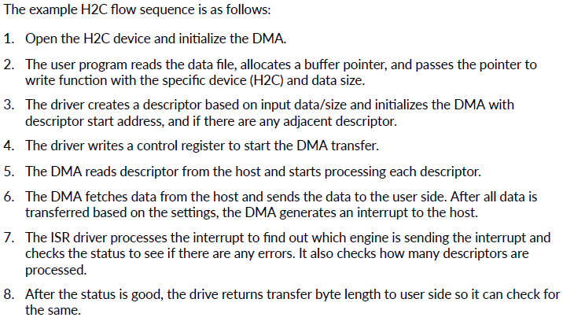

.. note::

   See the latest version of PG195 for updates

.. _example_c2h_flow:

Example C2H Flow
----------------
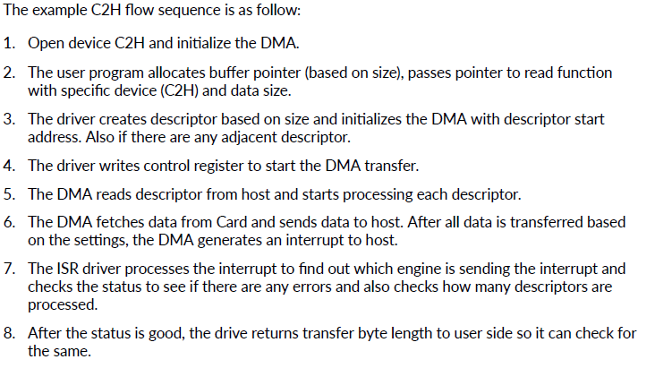

.. note::

   See the latest version of PG195 for updates

.. _initial_setup_for_h2c_and_c2h_transfers:

Initial Setup For H2C and C2H Transfers
---------------------------------------
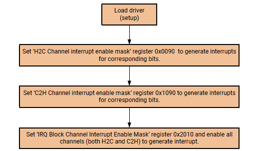

.. note::

   See the latest version of PG195 for updates

.. _dma_h2c_transfer_summary:

DMA H2C Transfer Summary
------------------------
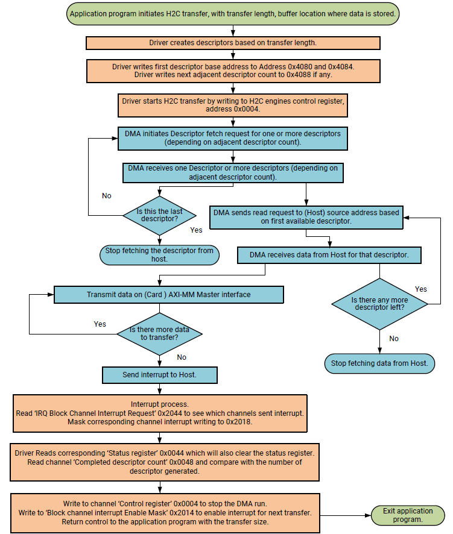

.. note::

   See the latest version of PG195 for updates

.. _dma_c2h_transfer_summary:

DMA C2H Transfer Summary
------------------------
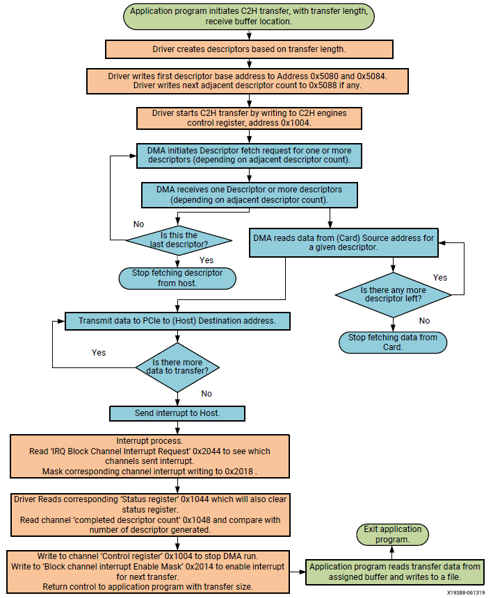

.. note::

   See the latest version of PG195 for updates
