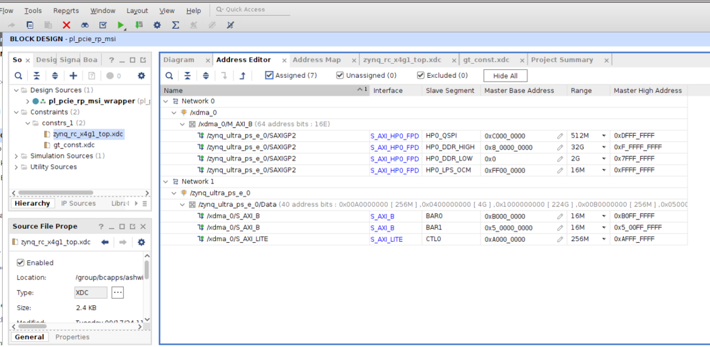
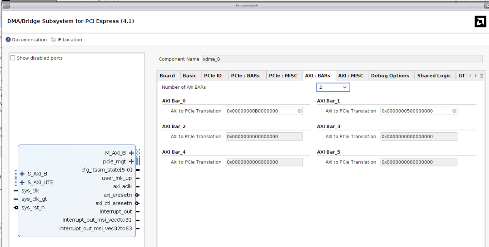
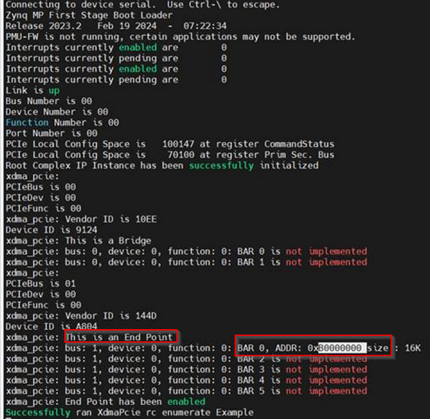

Debugging
=========

Address Editor Verification
---------------------------

• Make sure the address editor for `S_AXI_B` for Bar 0 and Bar 1 matches with the **AXI to PCIe translation field** tab in the Vivado GUI.

Command Register Writes
-----------------------

• Make sure to write to Command Registers as shown below:

**EP Command Register**

.. code-block:: bash

    xsdb% mwr -force 0xa0100004 0x7

**RP Command Register**

.. code-block:: bash

    xsdb% mwr -force 0xa0000004 0x7

Bus Number Verification
-----------------------

• Confirm Secondary Bus and Primary Bus Numbers at offset `0x18` as `0x10100`.

.. code-block:: bash

    xsdb% mrd 0xa0000018

Status/Control Register Check
-----------------------------

• Confirm the **Bridge Enable** bit in the RP Status/Control Register at Offset `0x148` is `0x1`.

.. code-block:: bash

    xsdb% mrd 0xa0000148

MSI-X Capability Access
-----------------------

• The MSI-X capability offset may vary by device. Use `lspci -vvv` on the endpoint to identify this offset. For instance:

.. code-block:: text

    Capabilities: [b0] MSI-X: Enable- Count=8 Masked-
        Vector table: BAR=0 offset=00003000
        PBA: BAR=0 offset=00002000

• Here the MSI-X capability is at offset `0xb0`.

• To access the **MSI-X Vector Table**, compute:  
  `[BAR Address (0xB000000) + Vector Table Offset (0x00003000)]`.

• Read the MSI-X capability at offset `0xb0` in `xsdb`:

.. code-block:: bash

    xsdb% mrd -force 0xa01000b0

Output:

.. code-block:: text

    A01000B0:   00070011

• Vector table can be read in `xsdb`:

.. code-block:: bash

    xsdb% mrd -force 0xa01000b4

Output:

.. code-block:: text

    A01000B4:   00003000

• PBA Offset can be read in `xsdb`:

.. code-block:: bash

    xsdb% mrd -force 0xa01000b8

Output:

.. code-block:: text

    A01000B8:   00002000

Endpoint BAR Read/Write
-----------------------

• The Endpoint BAR read/write operations can be done as follows:

**Reading the EP BAR**

.. code-block:: bash

    xsdb% mrd -force 0xB0003000

Output:

.. code-block:: text

    B0003000:   00000000

**Writing to the EP BAR**

.. code-block:: bash

    xsdb% mwr -force 0xb0003000 0xdeadbeef
    xsdb% mrd -force 0xB0003000

Output:

.. code-block:: text

    B0003000:   DEADBEEF
