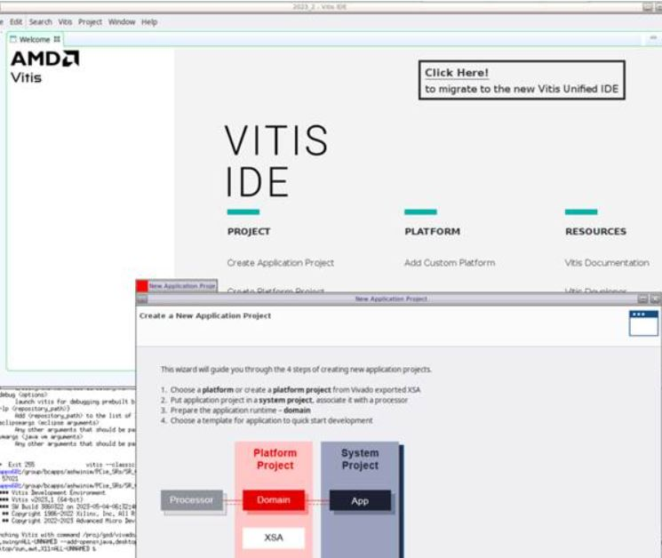
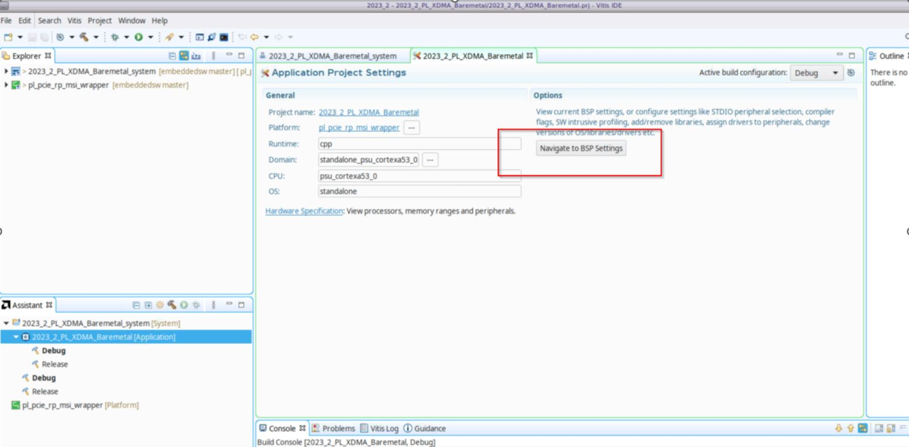

ELF File Generation Steps
=========================

1. Clone `embeddedsw` repo from Xilinx GitHub in the desired folder::

    git clone https://github.com/Xilinx/embeddedsw/tree/xlnx_rel_v2023.2

2. Open Vitis 2023.2 and create a new workspace directory.

3. Apply the "embeddedsw" repository in Vitis:

   a. In Vitis, navigate to **Vitis → Software Repositories**.  
   b. Click the **New** tab, select `embeddedsw`, and click **OK**.

4. Create an application project for Vitis.

5. Select **Create new platform from hardware (XSA)** and provide the path to the 2023.2 design. Then, click **Next**.

6. Enter the project name and target details, then click **Next**.

7. On the Domain page, you can leave the default settings as they are and click **Next**.

8. Select **Hello World** and click **Finish**.

9. Click on **Navigate to BSP Settings**. In the list of drivers, scroll down and select the `XDMA_0` driver, then choose the **Import Examples** option, as shown below.

10. Build the application by pressing **Ctrl + B**.

11. The generated `xdmapcie rc enumerate example` ELF can be used to test enumeration and BAR access in XDMA PL-PCIe4 RC bridges. This example initializes the XDMA PCIe IP and demonstrates how to enumerate the PCIe system.

.. note::

   This example should only be used when the XDMA PCIe IP is configured as a root complex.  
   The code illustrates how to use the XDMA PCIe IP and its standalone driver to:

   - Initialize an XDMA PCIe IP core built as a root complex
   - Enumerate PCIe endpoints in the system
   - Assign BARs to endpoints
   - Find capabilities on endpoints

   Please note, this example only enumerates and initializes PCIe endpoints.

