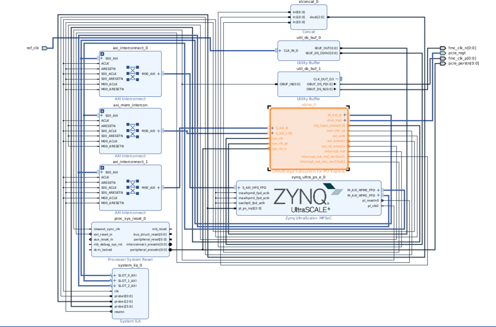

Design Creation in IP Integrator
================================

The figure below shows the block design for the ZCU106 evaluation board with PCI Express set up as the Root Complex.

Design Configuration
--------------------

The design is configured with the following settings:

- **Functional Mode:** XDMA as AXI Bridge  
- **Mode:** Advanced  
- **Device/Port Type:** Root Port of PCI Express Root Complex  
- **PCIe Block Location:** X0Y1  
- **GT Quad:** GTH Quad 227  
- **Lane Width:** X4  
- **Maximum Link Speed:** 5.0 GT/s  
- **AXI Address Width:** 64 bits  
- **AXI Data Width:** 64 bits  

Download the TCL script for generating the design from the link below:

:download:`genBd.tcl <./hardware_design_creation/genBd.tcl>`
