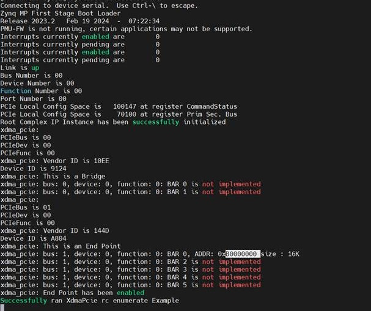

Hardware Programming
====================

Before running the application, the hardware need to be setup.

- Power on the hardware platform and ensure that the JTAG connection is properly established.
- To receive the UART output of this standalone application, connect the USB-UART of the development board to the PC and run a console program, such as PuTTY.

Boot Steps
----------

1. Go to **Debug Configurations**.
2. Select **Single Application Debug**.
3. Navigate to the **Connection** tab, click **New**, and select the appropriate hardware.

   .. note::

      Ensure the hardware is set up correctly before executing this step.

   .. image:: running_in_hardware/img_1.jpg
      :alt: Debug Configuration - Connection Tab
      :align: center

4. Select the ELF file generated in the application.

   .. image:: running_in_hardware/img_2.jpg
      :alt: ELF File Selection
      :align: center

5. Click **Debug** and check the output in the serial monitor.

   .. image:: running_in_hardware/img_3.jpg
      :alt: Serial Monitor Output
      :align: center

6. Click on the highlighted icon.

   .. image:: running_in_hardware/img_4.jpg
      :alt: Highlighted Debug Icon
      :align: center

The run configuration will first program the FPGA with the bitstream, then load and execute the application. You can view the UART output of the application in the console window, and it should appear as follows, indicating that the endpoint (EP) has been successfully enumerated.

