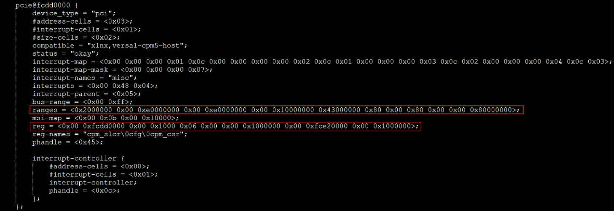
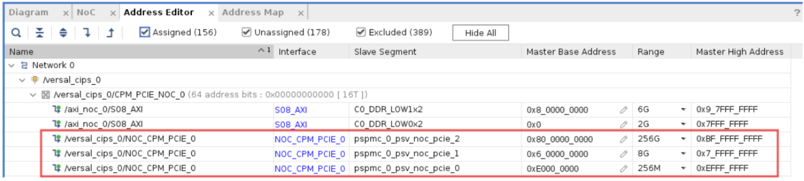

Device Tree Structure
=====================

Below snippet shows the Device Tree information of the PCIe node in the CED example design:

The ``reg`` property defines the physical addresses and sizes of various hardware registers.
It is specified as a sequence of (address, size) pairs, corresponding to entries in the ``reg-names`` property:

.. code-block:: none

   reg-names = "cpm_slcr\0cfg\0cpm_csr";
   reg = <0x00 0xfcdd0000  0x00 0x1000
          0x06 0x00000000  0x00 0x1000000
          0x00 0xfce20000  0x00 0x1000000>;

**Explanation**

**cpm_slcr**
- Address: ``0x00 0xfcdd0000``
- Size: ``0x00 0x1000`` (4 KB)
- Description: CPM5 System Level Control Register (SLCR)

**cfg**
- Address: ``0x06 0x00000000``
- Size: ``0x00 0x1000000`` (16 MB)
- Description: ECAM (Enhanced Configuration Access Mechanism) space

**cpm_csr**
- Address: ``0x00 0xfce20000``
- Size: ``0x00 0x1000000`` (16 MB)
- Description: CPM5 DMA0 Control and Status Registers (CSR)

The ``ranges`` property in the Device Tree is derived from the CPM5 IP configuration,
specifically from the AXI: BARs tab in the IP configuration GUI.

.. code-block:: none

   ranges = <0x2000000  0x00 0xe0000000  0x00 0xe0000000  0x00 0x10000000
             0x43000000 0x80 0x00000000  0x80 0x00000000  0x00 0x80000000>;

This entry defines how PCIe address regions are mapped to the CPU address space.
It includes two Base Address Registers (BARs):

**Entry 1: 32-bit BAR (BAR0 / PCIe Region 0)**
- ``0x2000000`` — Flag indicating a 32-bit memory BAR
- ``0x00 0xe0000000`` — PCIe address (BAR0)
- ``0x00 0xe0000000`` — Corresponding CPU address
- ``0x00 0x10000000`` — Size: 256 MB

**Entry 2: 64-bit BAR (BAR2 / PCIe Region 2)**
- ``0x43000000`` — Flag indicating a 64-bit memory BAR
- ``0x80 0x00000000`` — PCIe address (BAR2)
- ``0x80 0x00000000`` — Corresponding CPU address
- ``0x00 0x80000000`` — Size: 2 GB

.. note::

   - Although BAR2 is configured as 256 GB in the AXI:BARs tab of the CPM5 IP GUI, the IP driver allocates only 2 GB, which is sufficient for operation.
   - PCIe Region 1 (BAR1) with a base address of ``0x06_00000000`` is reserved for ECAM (Enhanced Configuration Access Mechanism) space.
   - All BAR assignment details are also shown in the Address Editor tab, as illustrated in the following snippet:

