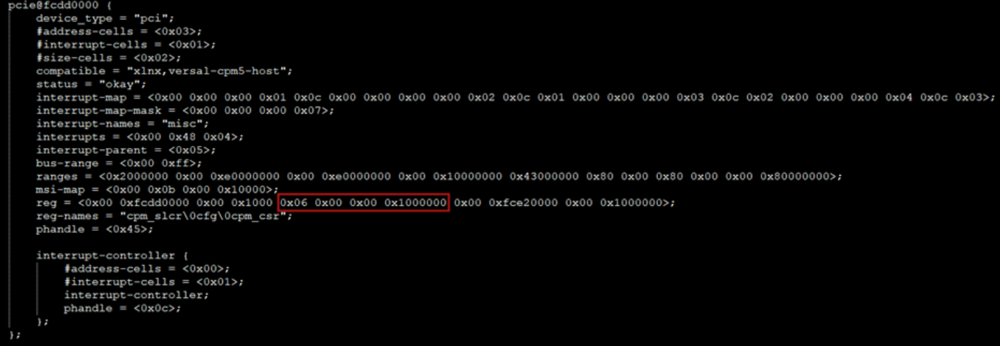
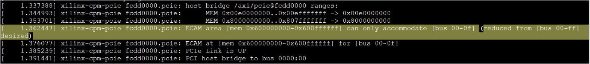
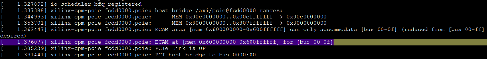

ECAM Mapping and Addressing
===========================

The ECAM (Enhanced Configuration Access Mechanism) space is typically defined in the Device Tree (``.dts`` file) under the PCIe node using the ``reg`` property:

In the example above:

- **ECAM Base Address:** ``0x0600_0000_00``
- **ECAM Size:** ``0x0100_0000`` (16 MB)

The probe function ``xilinx_cpm_pcie_probe``, located in the file ``pcie-xilinx-cpm.c`` within the Linux kernel source  
(``linux-xlnx/drivers/pci/controller/pcie-xilinx-cpm.c``), is responsible for handling ECAM address mapping.

During system initialization in the CED, the following warning appears in the boot log:

This message indicates the following:

- The desired PCIe bus range is ``[bus 00-ff]``, which corresponds to bus numbers 0 through 255.
- However, due to the ECAM size limitation, the bus range is adjusted to ``[bus 00-0f]``, meaning only buses 0 through 15 are supported.
- The ECAM memory region is defined as ``[mem 0x600000000-0x600ffffff]``, totaling **16 MB**.

.. note::

   - **Memory required per bus:** Each bus requires ``2^bus_shift`` bytes of memory.
     - For ``bus_shift = 20``, this equals **1 MB per bus**.
   - **Maximum number of buses supported:**
     - ``16 MB / 1 MB = 16`` → Buses **0 through 15** can be addressed.

The following log snippet shows a successful mapping message:

