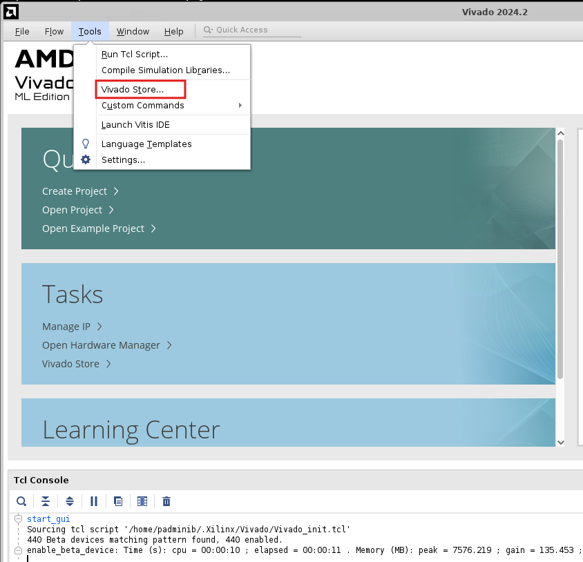

.. _ps_pcie_pl_pcie_driver_debug_checklist:

Hardware Design Creation
=======================

Launch Vivado 2024.2 tool and select “Vivado Store” from the “Tools” list.

In the “Vivado Store”, click on the “Example Designs” tab at the top of the left, then click the “Refresh” button at the bottom left. Vivado will contact GitHub to make sure the list of example designs is up to date. Locate the “Versal CPM Bridge RP Design” in the list. If the glyph is a grey circle with a down arrow, it means the example design needs to be downloaded – proceed to download it. If the glyph is a green check with a yellow dot, it means the example design needs to be updated – proceed to update it. Once the catalog is up to date and the glyph is a green check without any other annotation, it means the example design is downloaded and up to date.

Once this example design is downloaded and up to date, close the “Vivado Store” by clicking “Close”.

Select “Open Example Project” from the “Quick Start” list.

.. image:: HW_Design/img_3.jpg
   :alt: Open Example Project

Advance through the wizard by clicking “Next”.

.. image:: HW_Design/img_4.jpg
   :alt: Wizard Next Button

Access the “Versal CPM Bridge RP Design” example project.

.. image:: HW_Design/img_5.jpg
   :alt: Versal CPM Bridge RP Design Project

Based on earlier steps, the example project should be showing as downloaded and up to date. With the example project selected, the “Description” should show basic information about the example project. Advance to the next step by clicking “Next”.

Specify a project name and project location.

.. image:: HW_Design/img_6.jpg
   :alt: Project Name and Location

Select the “Versal VPK120 Evaluation Platform”, switch part to xcvp1202-vsva2785-2MHP-e-S and click “Next”.

.. image:: HW_Design/img_7.jpg
   :alt: Select Evaluation Platform

Ensure that CPM5 is auto-selected. Select "CPM5 PCIe Controller0 Gen4x8 RootPort Design" as CPM5_Preset and click “Next”.

.. image:: HW_Design/img_8.jpg
   :alt: CPM5 PCIe Controller Configuration

Review the Project Summary to confirm that the part and product family selections are correct. Advance through the wizard by clicking “Finish”.

Wait until the project creation, file import, and hierarchy update has completed. This may take a few minutes.

No changes need to be made on any portion of this design. Feel free to investigate any properties of the IP Blocks in the design to learn more about the details of this example design.

Below is the block diagram of the "cpm_rp.bd":

From “Flow Navigator” click “Generate Device Image”

.. image:: HW_Design/img_11.jpg
   :alt: Generate Device Image

Export Hardware Design to Generate .xsa file for the Project

From File menu, select "Export" --> "Export Hardware"

.. image:: HW_Design/img_12.jpg
   :alt: Export Hardware Menu

Select “Next”, and “Include Device Image”.

Create a .xsa file name and select export location. By default, the export location is inside of the project directory made earlier. Click on Next.

Click on Finish.

