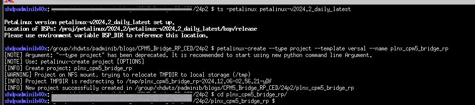

.. _ps_pcie_pl_pcie_driver_debug_checklist:

==========================
PetaLinux Image Generation
==========================

Launching PetaLinux 2024.2
--------------------------
To launch PetaLinux 2024.2, source the `settings.sh` script using the following command:

.. code-block:: bash

    source <path-to-petalinux-install>/2024.2/settings.sh

Creating a PetaLinux Project
----------------------------
Navigate to a directory where you wish to create a workspace for the PetaLinux project. Use the following command:

.. code-block:: bash

    petalinux-create project --template versal --name <PROJECT_NAME_HERE>

This command creates a workspace directory for the PetaLinux project. All details related to the build, such as the configured device tree and kernel, will be located here. All project modifications will be contained in this directory.

After creating an empty project, configure this project with the appropriate settings needed for this application.

Configuring the PetaLinux Project
---------------------------------
For system image, the example design configured in Vivado will be used.

1. **Configure the project with the .xsa file from Vivado**:

   .. code-block:: bash

       petalinux-config --get-hw-description=<PATH_TO_XSA_DIRECTORY>

   Since there is only one `.xsa` file in the directory, the PetaLinux tool will automatically pick the appropriate file and begin configuration.

   .. image:: Petalinux_Image_Generation/img_17.jpg

2. **Navigate through the configuration menu**:

   Upon running the above command, a PetaLinux configuration menu will appear. Use the arrow keys to navigate and the `Enter` key to select or perform actions.

   .. image:: Petalinux_Image_Generation/img_18.jpg

3. **Exit the configuration menu**:

   In this menu, no modifications are needed. To exit:
   - Use the right arrow key to highlight "Exit".
   - Press `Enter`.
   - When prompted to save changes, select "Yes".

   The terminal output should resemble the screenshot below:

   .. image:: Petalinux_Image_Generation/img_19.jpg

4. **Kernel configuration for PCIe and NVME support**:

   To configure the kernel, run:

   .. code-block:: bash

       petalinux-config -c kernel

   This opens a kernel configuration menu. Note that it may take some time for the menu to load.

5. **Enable PCIe drivers**:

   - Navigate to "Device Drivers".

     .. image:: Petalinux_Image_Generation/img_20.jpg

   - Select "PCI support".

     .. image:: Petalinux_Image_Generation/img_21.jpg

   - Select "PCI controller drivers".

     .. image:: Petalinux_Image_Generation/img_22.jpg

   - Enable "Xilinx Versal CPM PCI controller":
     - Hover over the option.
     - Press the spacebar to add an asterisk (`*`).
     - Exit back to the "Device Drivers" menu.

     .. image:: Petalinux_Image_Generation/img_23.jpg

6. **Enable NVME support**:

   - Navigate to the "NVME Support" section.

     .. image:: Petalinux_Image_Generation/img_24.jpg

   - Enable "NVM Express block device" by pressing the spacebar twice.

     .. image:: Petalinux_Image_Generation/img_25.jpg

   - Exit and save the kernel configuration.

     .. image:: Petalinux_Image_Generation/img_26.jpg

7. **Root File System configuration**:

   To configure the Root File System, run:

   .. code-block:: bash

       petalinux-config -c rootfs

   - Navigate to the "Filesystem Packages" section.

     .. image:: Petalinux_Image_Generation/img_27.jpg

   - Enter the "base" section.

     .. image:: Petalinux_Image_Generation/img_28.jpg

   - Enter the "util-linux" section.

     .. image:: Petalinux_Image_Generation/img_29.jpg

   - Select all options in this menu to enable utility functions.

     .. image:: Petalinux_Image_Generation/img_30.jpg

   - Press "Exit" three times to return to the Root File System configuration menu.
   - Navigate to the "Image Features" section.

     .. image:: Petalinux_Image_Generation/img_31.jpg

   - Enable the following options:
     - "empty-root-password"
     - "serial-autologin-root"

     .. image:: Petalinux_Image_Generation/img_32.jpg

   - Exit and save the Root File System configuration. The terminal output should look similar to the screenshot below:

     .. image:: Petalinux_Image_Generation/img_33.jpg

Building the System Image and Booting
-------------------------------------

1. **Configuration and Build**:

The configuration of the PetaLinux project has been completed. To build the project, the following command should be entered:

.. code:: bash

    petalinux-build

This command may take a considerable amount of time to execute.

     .. image:: Petalinux_Image_Generation/img_34.jpg

Once the command completes, a warning message may appear regarding TFTPboot, depending on the system in use. This warning can be safely ignored, as the system is not being booted via a TFTP server. 

It is important to note that, occasionally, when running ``petalinux-build`` on a project with memory cached, an error may occur that causes the build to fail. To resolve this, the cache should be cleared, and a clean build can be performed by running the following command:

.. code:: bash

    petalinux-build -x mrproper

After executing this command, the ``petalinux-build`` command should be run again to successfully build the project.

2. **Packaging the System Image**:

Once the system image is built, it needs to be packaged in U-Boot to generate the necessary files for booting the system. The following command should be entered:

.. code:: bash

    petalinux-package --boot --format BIN --plm --psmfw --u-boot --dtb --force	

After the above command finishes executing, the PetaLinux build is complete, and the VPK120 board is ready to be booted.
	
     .. image:: Petalinux_Image_Generation/img_35.jpg

