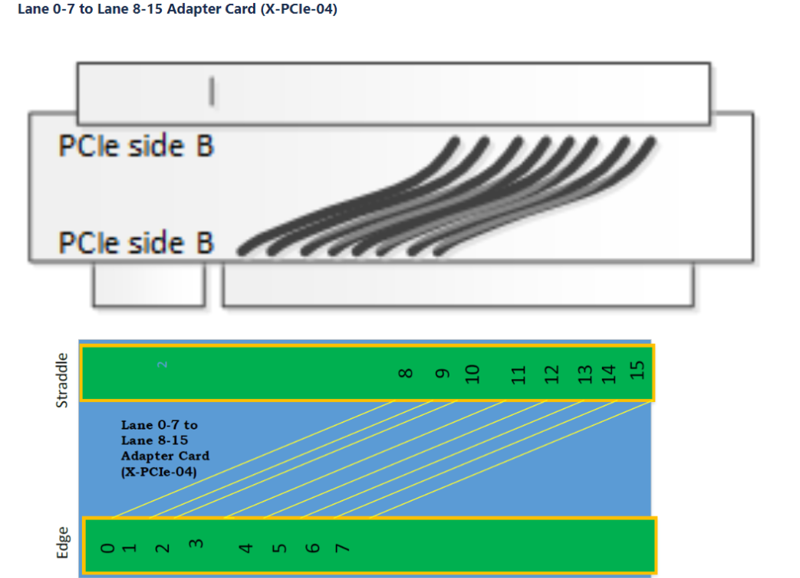
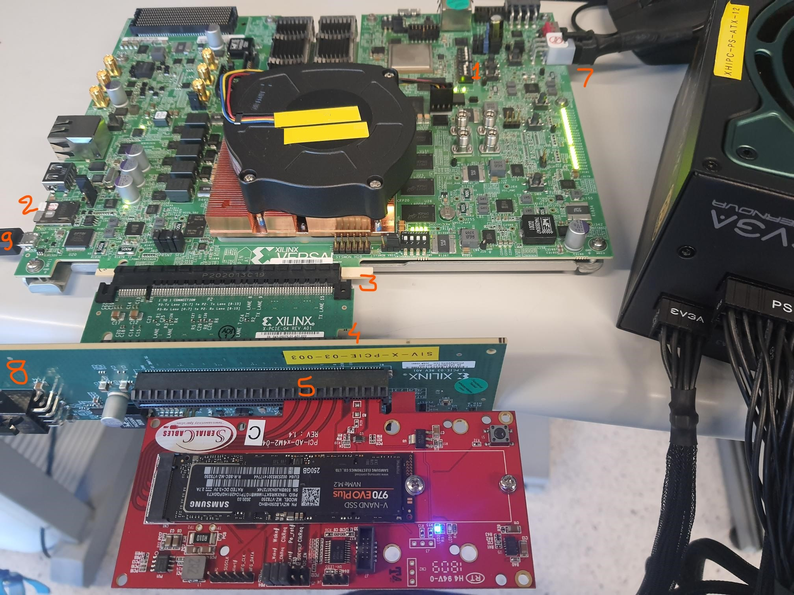
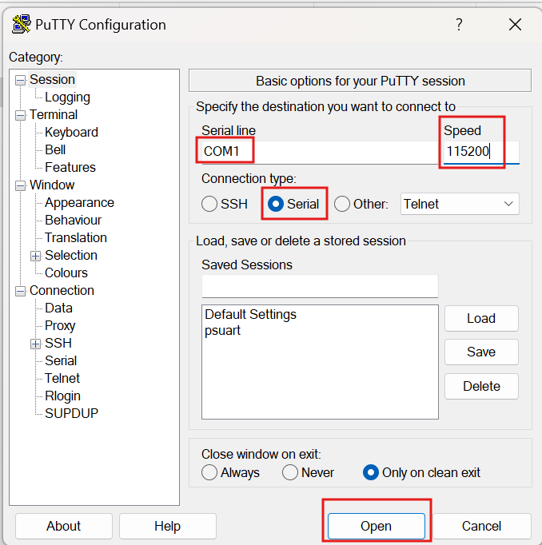
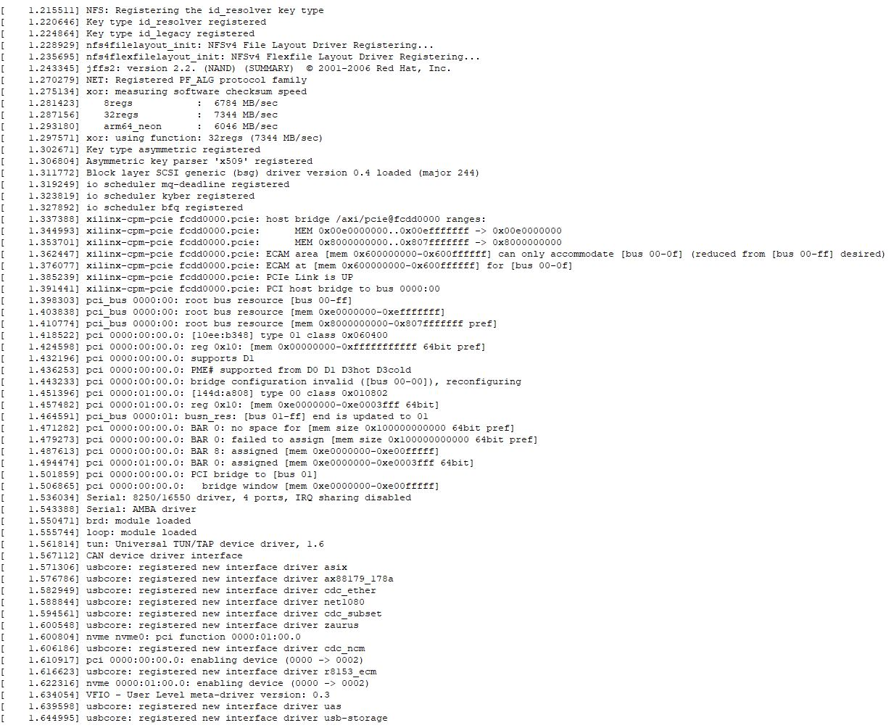
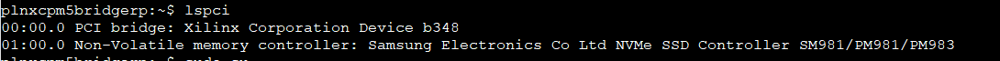
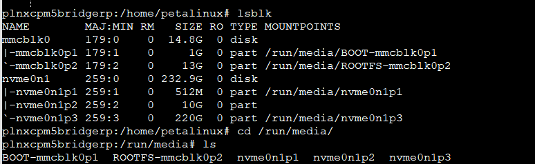

.. _ps_pcie_pl_pcie_driver_debug_checklist:

System Testability and Setup
============================

Loading Images onto SD
----------------------

To boot via SD card, the correct files need to be loaded onto the SD card. First, the SD card should be connected to the system. The following three files from the ``<PETALINUX_PROJECT_FOLDER>/images/linux`` path must be copied to the SD card:

- ``boot.scr``
- ``BOOT.BIN``
- ``image.ub``

Once the files are finished copying to the SD card, the device should be safely ejected. The system is now ready to work directly with the VPK120.

Booting and Testing
-------------------

Setting up Components
----------------------

**Boot Mode Configuration**

On the VPK120, ensure that the Boot Mode is set to the SD configuration. To do this, configure switch SW1 such that it is set to ON-OFF-OFF-OFF (in order from positions 1 to 4). Refer to the VPK120 user guide for more information.

**Connecting the SD Card and PCIe Components**

Insert the SD card into the SD card socket on the VPK120 board.

Connect the PCIe slot of the X-PCIE-04 card to the PCIe edge connector on the VPK120 board.

In this example design, the CPM5 preset is selected as "CPM5 PCIe Controller0." PCIe Controller0 drives Quad 102 and Quad 103 lanes, landing on Lane 8-Lane 15 of the VPK120 board. Therefore, an external lane shifter card (X-PCIE-04) is needed to shift the "Lane 8-Lane 15" signals to "Lane 0-Lane 7."

If PCIe Controller1 is used, it drives Quad 104 and Quad 105 lanes, landing on Lane 0-Lane 7 of the VPK120 board. In this case, the additional X-PCIE-04 lane-shifter card is not needed.

**Connecting Other Components**

- Connect the other end of the X-PCIE-04 card to the PCIe slot on the solder side (back/under side) of the X-PCIE-03 card.
- Connect the M.2 PCIe carrier card assembly with SSD into the PCIe slot on the component side (top/front side) of the X-PCIE-03.
- Assuming use of a modular ATX power supply to provide PCIe AUXPWR to the X-PCIE-03, connect the main "24-pin ATX" cable assembly and one "6+2 PCIe" cable assembly to the PSU. Also, connect the jumper bridge to the free end of the "24-pin ATX" cable. The free end of the "6+2 PCIe" cable assembly provides PCIe AUXPWR.
- Connect the DC power brick supplied with the VPK120 to J16 on the VPK120 board.
- Connect the ATX power supply AUXPWR cable to the X-PCIE-03 at J5.
- Connect the USB cable provided with the VPK120 to J344, and then to an available USB port on the PC.
- Connect the DC power brick and the ATX power supply to AC power.

The following image shows the final test setup:

Once all connections are made, open the Putty application on the connected machine. Select the connection type as "Serial" and choose the appropriate COM port number. For "Speed," select 115200. After clicking "Open," a terminal window will appear.

**Powering On the VPK120**

The system is now ready to be powered on. Ensure that the power cables are plugged in, and that the proper power supply units are turned on. To boot the system, flip the switch next to the 6-pin power connector on the VPK120.

Interacting with PetaLinux
--------------------------

**Boot Process**

Once the system begins booting, the terminal will start showing information about the boot process of the VPK120. Eventually, the user will be automatically logged in as the root user in Linux.

**Driver Initialization**

Below are print messages that show the "Driver Initialization" portion of the kernel console output.

**Verifying PCIe Devices**

To verify if the Linux OS can detect the connected PCIe devices, the following command should be entered in the terminal:

.. code:: bash

    lspci

Two lines of output should appear—one for the X-PCIe adapter and one for the NVMe drive connected.

For more detailed information about each PCIe device, the following commands can be used:

.. code:: bash

    lspci -vvvs 00:00.0  # For the Xilinx device
    lspci -vvvs 01:00.0  # For the NVMe device

The system should have automatically mounted the drive. The result of the ``lsblk`` command is shown in the image below:

**Performing I/O Tests**

To measure the drive's performance, I/O tests can be performed.

**Testing Write Speed**

To test the drive's write speed, enter the following command into the terminal:

.. code:: bash

    sync; dd if=/dev/zero of=tempfile bs=1M count=1024; sync

This command copies 1GB of data and outputs the write speed of the drive.

**Testing Read Speed**

To test the read speed, clear the cache first and then run a similar command. Enter the following in this order:

.. code:: bash

    sudo /sbin/sysctl -w vm.drop_caches=3
    dd if=tempfile of=/dev/null bs=1M count=1024

This command outputs the read speed for a 1GB file copy and shows the speed of this operation. The commands create a 1GB file called ``tempfile`` to measure read and write speeds.
