.. _qdma_global_port_descriptions:

QDMA Global Port Descriptions
-----------------------------

.. note::

   * The table above is sourced from PG302. Refer to the links below for the relevant IP table.
   * PG302: https://docs.amd.com/r/en-US/pg302-qdma/QDMA-Global-Ports
   * PG344: https://docs.amd.com/r/en-US/pg344-pcie-dma-versal/QDMA-Global-Ports?tocId=OZuHNoSk7b_ljTFaCFeXow
   * PG347: https://docs.amd.com/r/en-US/pg347-cpm-dma-bridge/QDMA-Global-Ports

.. _axi4_memory_mapped_master_bridge_read_address_interface_port_descriptions:

AXI4 Memory Mapped Master Bridge Read Address Interface Port Descriptions
-------------------------------------------------------------------------
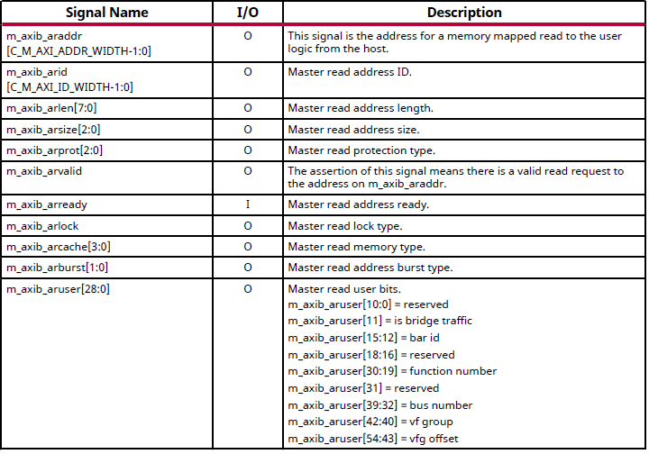

.. note::

   See the latest version of PG302 for updates

.. _axi4_memory_mapped_master_bridge_read_interface_port_descriptions:

AXI4 Memory Mapped Master Bridge Read Interface Port Descriptions
-----------------------------------------------------------------
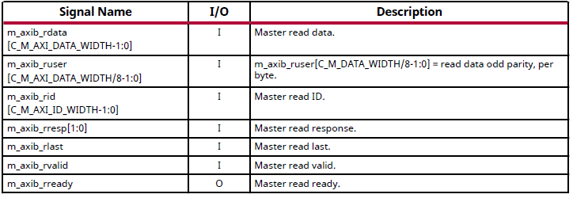

.. note::

   See the latest version of PG302 for updates

.. _axi4_memory_mapped_master_bridge_write_address_interface_port_descriptions:

AXI4 Memory Mapped Master Bridge Write Address Interface Port Descriptions
--------------------------------------------------------------------------

.. note::

   See the latest version of PG302 for updates

.. _axi4_memory_mapped_master_bridge_write_interface_port_descriptions:

AXI4 Memory Mapped Master Bridge Write Interface Port Descriptions
------------------------------------------------------------------

.. note::

   See the latest version of PG302 for updates

.. _axi4_memory_mapped_master_bridge_write_response_interface_port_descriptions:

AXI4 Memory Mapped Master Bridge Write Response Interface Port Descriptions
---------------------------------------------------------------------------

.. note::

   See the latest version of PG302 for updates

.. _axi4_bridge_slave_write_address_interface_port_descriptions:

AXI4 Bridge Slave Write Address Interface Port Descriptions
-----------------------------------------------------------
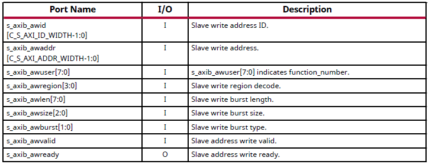

.. note::

   See the latest version of PG302 for updates

.. _axi4_bridge_slave_write_interface_port_descriptions:

AXI4 Bridge Slave Write Interface Port Descriptions
---------------------------------------------------

.. note::

   See the latest version of PG302 for updates

.. _axi4_bridge_slave_write_response_interface_port_descriptions:

AXI4 Bridge Slave Write Response Interface Port Descriptions
------------------------------------------------------------

.. note::

   See the latest version of PG302 for updates

.. _axi4_bridge_slave_read_address_interface_port_descriptions:

AXI4 Bridge Slave Read Address Interface Port Descriptions
----------------------------------------------------------

.. note::

   See the latest version of PG302 for updates

.. _axi4_bridge_slave_read_interface_port_descriptions:

AXI4 Bridge Slave Read Interface Port Descriptions
--------------------------------------------------

.. note::

   See the latest version of PG302 for updates

.. _config_axi4-lite_memory_mapped_write_master_interface_port_descriptions:

Config AXI4-Lite Memory Mapped Write Master Interface Port Descriptions
-----------------------------------------------------------------------

.. note::

   See the latest version of PG302 for updates

.. _config_axi4-lite_memory_mapped_read_master_interface_port_descriptions:

Config AXI4-Lite Memory Mapped Read Master Interface Port Descriptions
----------------------------------------------------------------------
.. image:: table_images/013_config_axi4-lite_memory_mapped_read_master_interface_port_descriptions.png
   :align: center

.. note::

   See the latest version of PG302 for updates

.. _config_axi4-lite_memory_mapped_write_slave_interface_signals:

Config AXI4-Lite Memory Mapped Write Slave Interface Signals
------------------------------------------------------------

.. note::

   See the latest version of PG302 for updates

.. _config_axi4-lite_memory_mapped_read_slave_interface_signals:

Config AXI4-Lite Memory Mapped Read Slave Interface Signals
-----------------------------------------------------------

.. note::

   See the latest version of PG302 for updates

.. _axi4_memory_mapped_dma_read_address_interface_signals:

AXI4 Memory Mapped DMA Read Address Interface Signals
-----------------------------------------------------

.. note::

   See the latest version of PG302 for updates

.. _axi4_memory_mapped_dma_read_interface_signals:

AXI4 Memory Mapped DMA Read Interface Signals
---------------------------------------------

.. note::

   See the latest version of PG302 for updates

.. _axi4_memory_mapped_dma_write_address_interface_signals:

AXI4 Memory Mapped DMA Write Address Interface Signals
------------------------------------------------------

.. note::

   See the latest version of PG302 for updates

.. _axi4_memory_mapped_dma_write_interface_signals:

AXI4 Memory Mapped DMA Write Interface Signals
----------------------------------------------
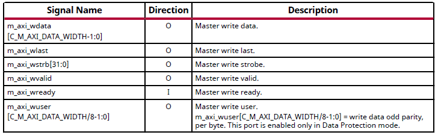

.. note::

   See the latest version of PG302 for updates

.. _axi4_memory_mapped_dma_write_response_interface_signals:

AXI4 Memory Mapped DMA Write Response Interface Signals
-------------------------------------------------------
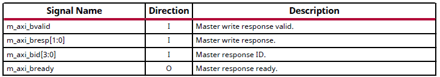

.. note::

   See the latest version of PG302 for updates

.. _axi4-stream_h2c_port_descriptions:

AXI4-Stream H2C Port Descriptions
---------------------------------

.. note::

   See the latest version of PG302 for updates

.. _axi4-stream_c2h_port_descriptions:

AXI4-Stream C2H Port Descriptions
---------------------------------

.. note::

   See the latest version of PG302 for updates

.. _axi4-stream_c2h_completion_port_descriptions:

AXI4-Stream C2H Completion Port Descriptions
--------------------------------------------

.. note::

   See the latest version of PG302 for updates

.. _axi-st_c2h_status_port_descriptions:

AXI-ST C2H Status Port Descriptions
-----------------------------------
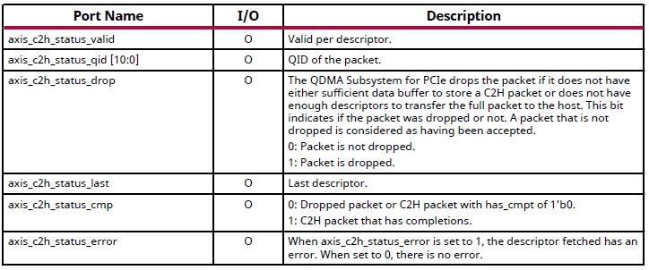

.. note::

   See the latest version of PG302 for updates

.. _axi-st_c2h_write_cmp_port_descriptions:

AXI-ST C2H Write Cmp Port Descriptions
--------------------------------------

.. note::

   See the latest version of PG302 for updates

.. _vdm_port_descriptions:

VDM Port Descriptions
---------------------

.. note::

   See the latest version of PG302 for updates

.. _configuration_extend_interface_port_descriptions:

Configuration Extend Interface Port Descriptions
------------------------------------------------

.. note::

   See the latest version of PG302 for updates

.. _flr_port_descriptions:

FLR Port Descriptions
---------------------
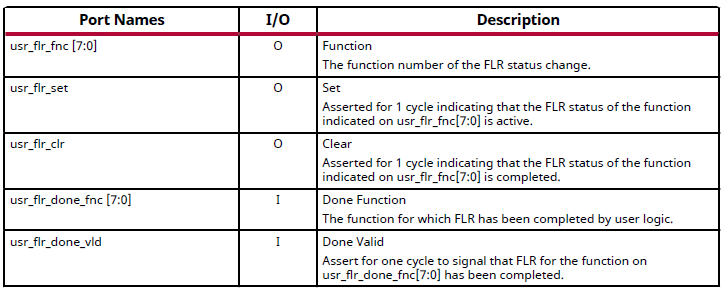

.. note::

   See the latest version of PG302 for updates

.. _qdma_h2c-streaming_bypass_input_port_descriptions:

QDMA H2C-Streaming Bypass Input Port Descriptions
-------------------------------------------------

.. note::

   See the latest version of PG302 for updates

.. _qdma_h2c-mm_descriptor_bypass_input_port_descriptions:

QDMA H2C-MM Descriptor Bypass Input Port Descriptions
-----------------------------------------------------

.. note::

   See the latest version of PG302 for updates

.. _qdma_c2h-streaming_cache_bypass_input_port_descriptions:

QDMA C2H-Streaming Cache Bypass Input Port Descriptions
-------------------------------------------------------
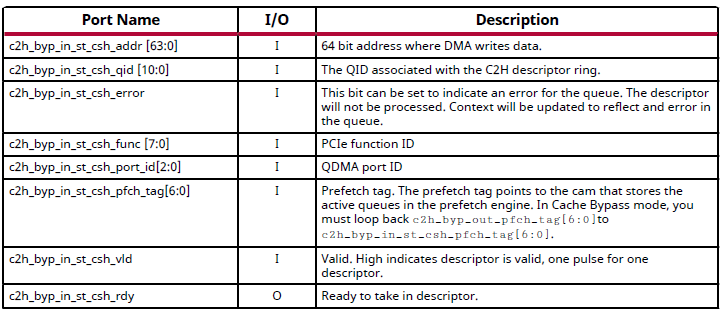

.. note::

   See the latest version of PG302 for updates

.. _qdma_c2h-mm_descriptor_bypass_input_port_descriptions:

QDMA C2H-MM Descriptor Bypass Input Port Descriptions
-----------------------------------------------------
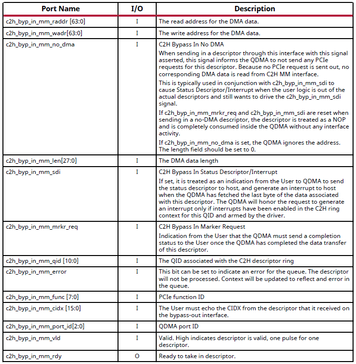

.. note::

   See the latest version of PG302 for updates

.. _qdma_h2c_descriptor_bypass_output_port_descriptions:

QDMA H2C Descriptor Bypass Output Port Descriptions
---------------------------------------------------
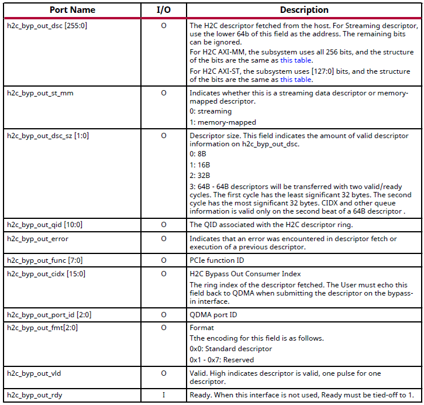

.. note::

   See the latest version of PG302 for updates

.. _qdma_c2h_descriptor_bypass_output_port_descriptions:

QDMA C2H Descriptor Bypass Output Port Descriptions
---------------------------------------------------
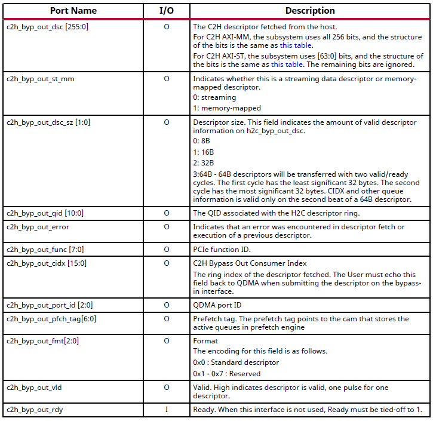

.. note::

   See the latest version of PG302 for updates

.. _qdma_descriptor_credit_input_port_descriptions:

QDMA Descriptor Credit Input Port Descriptions
----------------------------------------------

.. note::

   See the latest version of PG302 for updates

.. _qdma_tm_credit_output_port_descriptions:

QDMA TM Credit Output Port Descriptions
---------------------------------------

.. note::

   See the latest version of PG302 for updates

   
.. _user_interrupts_port_descriptions:

User Interrupts Port Descriptions
---------------------------------

 
.. note::

   See the latest version of PG302 for updates

.. _queue_status_ports:

Queue Status Ports
------------------

.. note::

   See the latest version of PG302 for updates

.. _queue_status_data:

Queue status data
-----------------

.. note::

   See the latest version of PG302 for updates

.. _axi4_memory_mapped_c2h_flow:

AXI4 Memory Mapped C2H Flow
---------------------------

.. note::

   See the latest version of PG302 for updates

.. _axi4_memory_mapped_h2c_flow:

AXI4 Memory Mapped H2C Flow
---------------------------

.. note::

   See the latest version of PG302 for updates

.. _axi4-stream_c2h_flow:

AXI4-Stream C2H Flow
--------------------

.. note::

   See the latest version of PG302 for updates

.. _axi4-stream_h2c_flow:

AXI4-Stream H2C Flow
--------------------

.. note::

   See the latest version of PG302 for updates

.. _context_programming:

Context Programming
-------------------

.. note::

   See the latest version of PG302 for updates

.. _descriptor_fetch_flow:

Descriptor Fetch Flow
---------------------

.. note::

   See the latest version of PG302 for updates

.. _software_descriptor_context_structure_definition:

Software Descriptor Context Structure Definition
------------------------------------------------

.. note::

   See the latest version of PG302 for updates

.. _hardware_descriptor_structure_definition:

Hardware Descriptor Structure Definition
----------------------------------------

.. note::

   See the latest version of PG302 for updates

.. _credit_descriptor_context_structure_definition:

Credit Descriptor Context Structure Definition
----------------------------------------------
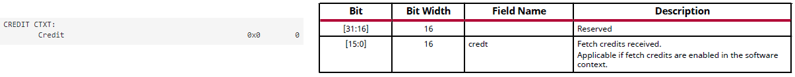

.. note::

   See the latest version of PG302 for updates

.. _c2h_prefetch_context_structure:

C2H Prefetch Context Structure
------------------------------
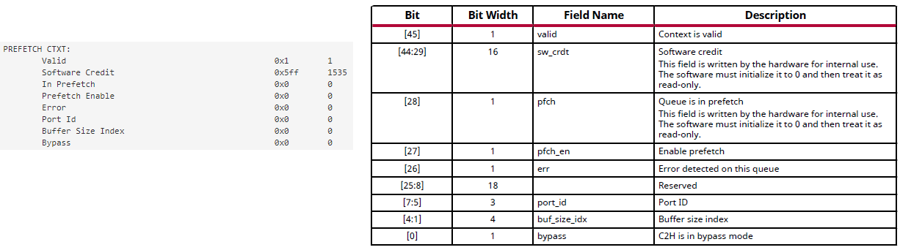

.. note::

   See the latest version of PG302 for updates

.. _h2c_internal_mode_flow:

H2C Internal Mode Flow
----------------------
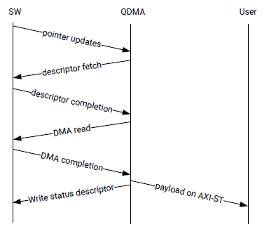

.. note::

   See the latest version of PG302 for updates

.. _h2c_bypass_mode_flow:

H2C Bypass Mode Flow
--------------------

.. note::

   See the latest version of PG302 for updates
   
   
.. _handling_exception_events:

Handling Exception Events
-------------------------

.. note::

   See the latest version of PG302 for updates

.. _h2c_and_c2h_queue:

H2C and C2H Queue
-----------------

.. note::

   See the latest version of PG302 for updates

.. _completion_queue_flow:

Completion Queue Flow
---------------------

.. note::

   See the latest version of PG302 for updates

.. _c2h_simple_bypass_mode_flow:

C2H Simple Bypass Mode Flow
---------------------------
.. image:: table_images/055_c2h_simple_bypass_mode_flow.png
   :align: center

.. note::

   See the latest version of PG302 for updates

.. _c2h_cache_bypass_mode_flow:

C2H Cache Bypass Mode Flow
--------------------------
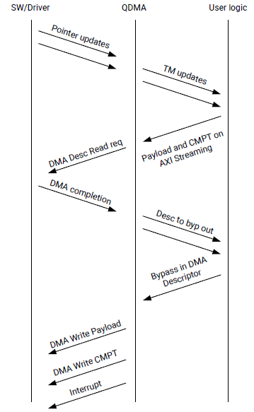

.. note::

   See the latest version of PG302 for updates

.. _axi_memory_mapped_writeback_status_structure_for_h2c_and_c2h:

AXI Memory Mapped Writeback Status Structure for H2C and C2H
------------------------------------------------------------
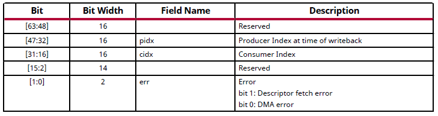

.. note::

   See the latest version of PG302 for updates

.. _axi4-stream_h2c_writeback_status_descriptor_structure:

AXI4-Stream Completion Status Structure
---------------------------------------

.. note::

   See the latest version of PG302 for updates

.. _axi4-stream_completion_status_structure:

AXI4-Stream H2C Writeback Status Descriptor Structure
-----------------------------------------------------

.. note::

   See the latest version of PG302 for updates

